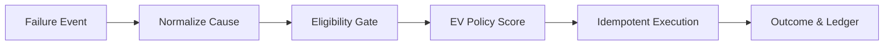

# 💸 AI Revenue Recovery — Failed Subscription & Auto-Debit Recovery

[](https://www.python.org/)
[](https://www.postgresql.org/)
[](https://fastapi.tiangolo.com/)
[]()

> **Find revenue that’s slipping away and win it back.**
> An intelligent agent that ingests failed payment events, diagnoses the root cause, filters actions through a strict legal gate, scores remaining options by Expected Net Value, executes idempotently, and proves its worth via a rigorous control arm.

---

## 📖 How it Works (The Simple Version)

Instead of blinding retrying every failed card and hoping for the best, this system acts like a hyper-rational, legally compliant agent. 



1. **Ingest & Normalize:** We take a raw gateway error (e.g., `insufficient_funds`) and standardize it.
2. **The Gate (Safety First):** *Before* the AI makes a choice, a strict rules engine removes illegal actions. If there is no standing mandate, the AI is physically barred from attempting a re-debit. 
3. **Score (Expected Value):** The AI policy scores permitted actions based on expected *net* value. It knows that sending an SMS costs money and annoys customers, so it only acts when the probability of success outweighs the costs.
4. **Execute & Audit:** The chosen action is executed, and the decision is permanently recorded in a cryptographically hash-chained PostgreSQL ledger.

> [!TIP]
> **We measure Incremental Value, not Gross.** We subtract the payments that would have recovered organically (e.g., a customer topping up on payday). If we claim money, it is because our agent is the *only* reason it was recovered.

---

## 🏆 The Result

Held-out test cohort, n = 3000. Disjoint merchants and customers from the training data, a later time window, and an outage pattern that does not appear in dev.

| arm                | incremental   | 95% CI                     | net          | debits | contacts |
| ------------------ | ------------- | -------------------------- | ------------ | ------ | -------- |
| B1 blind ladder    | 934,631       | [785,796, 1,099,298]       | **−147,259** | 7056   | 0        |
| B2 good rules      | 1,499,519     | [1,293,729, 1,715,769]     | 559,940      | 2915   | 1785     |
| B2.5 + outage rule | 1,565,637     | [1,359,492, 1,785,915]     | 586,720      | 2753   | 1763     |
| **AGENT**          | **1,739,601** | **[1,509,079, 1,975,881]** | **639,506**  | 2850   | **1056** |
| B3 greedy oracle   | 2,115,228     | [1,866,097, 2,352,416]     | 831,827      | 1950   | 1373     |

> [!NOTE]
> All figures are in INR. The agent **beats the rules baseline by +240,082** [71,499, 414,677] while sending **41% fewer customer contacts**, capturing **82.2%** of the greedy oracle's attainable uplift.

**The margin roughly halved out of sample and we lead with that.** Per 1000 intents, the paired advantage over B2.5 fell 55% dev → test and oracle share fell 93.8% → 82.2%. The baselines degraded less (−7% vs −16%) because rules do not overfit. Full delta table in [docs/results.md](docs/results.md).

We report **incremental**, not gross. Gross was 3,475,288; the 1.7M difference is what would have recovered anyway and we do not claim it.

---

## 🚀 Quick Start & Demo

Requires Docker and Python 3.11+.

```bash
git clone <repo> && cd razorpay
python3 -m venv .venv && source .venv/bin/activate
pip install -r requirements.txt

# Start DB and initialize schemas
docker compose up -d --wait db
make db-init && psql "$DATABASE_URL" -f sql/002_llm_call.sql && psql "$DATABASE_URL" -f sql/003_decision_seq.sql

make test          # Run the 83-test verification suite
make run           # End-to-end: processes 500 intents, writes every decision to Postgres
```

> [!WARNING]
> **Use the venv, not a conda base environment.** `openai` 3.x depends on **`httpx2`**. In a polluted conda base the SDK raises `TypeError: process() takes no keyword arguments`. Run everything via the venv.

### Viewing the Audit Trail
```bash
make report                          # Generates docs/report.html
make serve                           # Starts Audit API. Open: http://localhost:8080/audit/dev_pi_000040/html
AUDIT=dev_pi_000040 make audit       # The same reconstruction in psql
```

---

## 🧠 Deep Dive: The Architecture & Math

Full structural account in **[docs/architecture.md](docs/architecture.md)**.

### 1. Gate Before Policy
The gate runs before the policy and shapes the action space. The policy never sees an illegal action, meaning a hallucination or bad score produces an empty option set rather than a live regulatory breach.

### 2. Expected Net Value Objective
`p_success × (1 − p_organic) × amount × margin − attempt cost − contact cost − annoyance − chargeback risk`.

The `(1 − p_organic)` term is crucial. We measured the difference: on dev (n=6000), `ev_incremental` ties `ev_gross` on raw recovery, but it issues fewer debits, commits fewer true violations, and sends 8% fewer contacts. **It buys restraint.**

### 3. NO_ACTION is a First-Class Candidate
`NO_ACTION` is scored at exactly zero. It wins 13.2% of decisions, and 22.8% of intents are never touched at all. Why? 
- A rule removed the option.
- Someone else's payment outbid this one for human escalation.
- Nothing available cleared its own cost.

### 4. Success Model
An empirical-Bayes Beta-Binomial model with hierarchical shrinkage (not a black-box tree). Every score traces to a named cell: *"43 observations, 11 successes, posterior mean 0.26"*. Brier 0.1007 on held-out.

---

## 🛡️ Guardrails & Safety

Every **gated** arm (B2, B2.5, AGENT, B3) across every signal tier on the sealed cohort produced:
- **0 observable `NEVER_RETRY` violations** 
- **0 unauthorised debits** 

B1 (the ungated blind ladder) is the counterfactual: 1674 observable violations and 1391 unauthorised debits. The gate is the whole of that difference.

---

## 🤖 Where LLMs are Used (And Where They Are Not)

Two places, neither of which can select an action:

1. **Tail Normaliser (Ships OFF ❌)**
   - **Job:** Resolve gateway codes the deterministic map misses.
   - **Why it's off:** We measured it, and it lost money (−191,440, 95% CI [−370,675, −17,320]). Resolving a cause removes the conservative UNKNOWN chargeback pricing, causing the agent to debit more aggressively on bad data. The UNKNOWN path is a load-bearing safety mechanism.
2. **Explainer (Ships ON ✅)**
   - **Job:** Render a committed decision as prose.
   - **Safety:** Structurally contained. Cannot mutate records or name actions.

---

## ⚠️ Honest Limitations

Stated here rather than buried. Full list in [docs/shipping-config.md](docs/shipping-config.md).

1. **The agent loses on four causes.** `mandate_invalid` (−38,051) persists from dev and is a real weakness.
2. **B2.5's outage rule stopped being significant on test** (CI spans zero). 
3. **B3 is a greedy oracle**, so our "82.2% of attainable" is measured against a lower bound.
4. **`ESCALATE_HUMAN` is likely over-powered** in the frozen response model.
5. **Regulatory values are UNVERIFIED placeholders.** See [docs/compliance-open-questions.md](docs/compliance-open-questions.md).
6. **Data is synthetic.** Generated by a response model frozen before policy code existed.

---

## 🗺️ Repo Map

| Path | Purpose |
|------|---------|
| `rr/sim/` | Frozen response model, cohort generator, sim executor adapter |
| `rr/agent/` | EV policy, decision record, observable features |
| `rr/pipeline/` | Ingest, normalise, eligibility gate, Postgres sink |
| `rr/normalize/`, `rr/explain/` | Containment-tested LLM components |
| `rr/eval/` | Tick loop, metrics, ablations, sealed run |
| `rr/api/`, `rr/report/` | Audit endpoint, static HTML report |
| `docs/architecture.md` | **How it fits together**, and what it cannot do |
| `docs/results.md` | **The exact numbers** |
