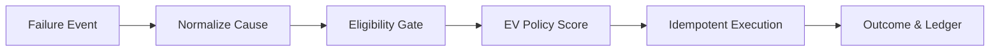

# 💸 AI Revenue Recovery — Failed Subscription & Auto-Debit Recovery

[](https://www.python.org/)
[](https://www.postgresql.org/)
[](https://fastapi.tiangolo.com/)
[]()

> **Find revenue that’s slipping away and win it back.**
> An intelligent agent that ingests failed payment events, diagnoses the root cause, filters actions through a strict legal gate, scores remaining options by Expected Net Value, executes idempotently, and proves its worth via a rigorous control arm.

---

## 📖 How it Works (The Simple Version)

Instead of blinding retrying every failed card and hoping for the best, this system acts like a hyper-rational, legally compliant agent. 



1. **Ingest & Normalize:** We take a raw gateway error (e.g., `insufficient_funds`) and standardize it.
2. **The Gate (Safety First):** *Before* the AI makes a choice, a strict rules engine removes illegal actions. If there is no standing mandate, the AI is physically barred from attempting a re-debit. 
3. **Score (Expected Value):** The AI policy scores permitted actions based on expected *net* value. It knows that sending an SMS costs money and annoys customers, so it only acts when the probability of success outweighs the costs.
4. **Execute & Audit:** The chosen action is executed, and the decision is permanently recorded in a cryptographically hash-chained PostgreSQL ledger.

> [!TIP]
> **We measure Incremental Value, not Gross.** We subtract the payments that would have recovered organically (e.g., a customer topping up on payday). If we claim money, it is because our agent is the *only* reason it was recovered.

**Every number below traces to [docs/results.md](docs/results.md)**, the single source of truth. It is generated from `docs/results_test.json`, the raw output of one run on a cohort that was read exactly once.

---

## 🏆 The Result

Held-out test cohort, n = 3000. Disjoint merchants and customers from the training data, a later time window, and an outage pattern that does not appear in dev.

| Arm                | Incremental   | 95% CI                     | Net          | Debits | Contacts |
| ------------------ | ------------- | -------------------------- | ------------ | ------ | -------- |
| B1 blind ladder    | 934,631       | [785,796, 1,099,298]       | **−147,259** | 7056   | 0        |
| B2 good rules      | 1,499,519     | [1,293,729, 1,715,769]     | 559,940      | 2915   | 1785     |
| B2.5 + outage rule | 1,565,637     | [1,359,492, 1,785,915]     | 586,720      | 2753   | 1763     |
| **AGENT**          | **1,739,601** | **[1,509,079, 1,975,881]** | **639,506**  | 2850   | **1056** |
| B3 greedy oracle   | 2,115,228     | [1,866,097, 2,352,416]     | 831,827      | 1950   | 1373     |

> [!IMPORTANT]
> All figures are in INR. The agent **beats the rules baseline by +240,082** [71,499, 414,677] while sending **41% fewer customer contacts**, and captures **82.2%** of the greedy oracle's attainable uplift.

**The margin roughly halved out of sample and we lead with that.** Per 1000 intents, the paired advantage over B2.5 fell 55% dev → test and oracle share fell 93.8% → 82.2%. The baselines degraded less (−7% vs −16%) because rules do not overfit. Full delta table in [results.md §2](docs/results.md).

We report **incremental**, not gross. Gross was 3,475,288; the 1.7M difference is what would have recovered anyway and we do not claim it.

---

## 🚀 Quick Start & Demo

Requires Docker and Python 3.11+.

```bash
git clone <repo> && cd razorpay
python3 -m venv .venv && ./.venv/bin/pip install -r requirements.txt
docker compose up -d --wait db
make db-init && psql "$DATABASE_URL" -f sql/002_llm_call.sql && psql "$DATABASE_URL" -f sql/003_decision_seq.sql
make test          # 83 tests; skips are labelled with a reason (-rs)
make run           # end-to-end: 500 intents, every decision written to Postgres
```

> [!WARNING]
> **Use the venv, not a conda base environment.** `openai` 3.x depends on **`httpx2`**, not `httpx`. In a polluted conda base the SDK raises `TypeError: process() takes no keyword arguments`. Identical versions work in a clean venv. Run everything as `./.venv/bin/python`.

> [!NOTE]
> **Database port.** Defaults to **55432** (`RR_DB_PORT`). If you have a local Postgres running on 5432, this prevents collision.

Optional, for the LLM components: `cp .env.example .env` and add `OPENAI_API_KEY` (unquoted).

---

## 👀 Viewing the Audit Trail

```bash
make report                          # docs/report.html — self-contained results page
make serve                           # then open /audit/dev_pi_000040/html
AUDIT=dev_pi_000040 make audit       # the same reconstruction in psql
make sealed-report                   # refuses: the cohort has already been read
```

### The Demo Row — `dev_pi_000040`
A ₹1,879.31 UPI checkout failure. The policy's **highest-scoring option was `retry_same` at ₹142.45** (p=0.2534, from a 19,819-observation cell) and **the eligibility gate removed it** — `R001_no_mandate_no_debit`, because a one-time checkout carries no standing authority to re-debit. The alternate rail went the same way; escalation fell below the value floor. It took the only permitted lever, an email nudge at ₹55.66.

At fire time the executor re-read payment state and found the customer had already paid **ten minutes earlier**. The nudge was aborted, not sent.

**Final Result**: Recovered ₹1,879.31, `attribution = organic`, **0 debits, 0 contacts**. The agent wanted three illegal things, took the one legal one, then correctly did not do that either.

---

## 🧠 Deep Dive: The Architecture & Math

Full structural account in **[docs/architecture.md](docs/architecture.md)**.

### 1. Gate Before Policy
**The gate runs before the policy and shapes the action space**, rather than vetoing afterwards. The policy never sees an illegal action, so a missed check produces an empty option set rather than a live regulatory breach.

### 2. Expected Net Value Objective
`p_success × (1 − p_organic) × amount × margin − attempt cost − contact cost − annoyance − chargeback risk`.

The `(1 − p_organic)` term is the objective agreeing with the metric. Multiplying by it means value accrues only on the branch where nothing else would have worked. 

> [!TIP]
> **We measured the difference.** `POLICY.ev_objective="gross"` runs as its own arm. On dev (n=6000), `ev_incremental` ties `ev_gross` on recovery. The honest reading is that the term does not buy measurable incremental recovery; **it buys restraint.** The gross objective reaches the same recovery while sending **8% more customer contacts**, issuing more debits, and committing more true `NEVER_RETRY` violations.

### 3. NO_ACTION is a Scored Candidate
**`NO_ACTION` is a scored candidate at exactly zero**, not a fallback branch. It wins 13.2% of decisions, and 22.8% of intents are never touched at all. Why?
1. A rule removed the option.
2. **Someone else's payment outbid this one** in the escalation capacity auction.
3. Nothing available cleared its own cost.

### 4. Success Model
The model is an **empirical-Bayes Beta-Binomial with hierarchical shrinkage** — not a fitted tree. Every score traces to a named cell: *"43 observations, 11 successes, posterior mean 0.26, 90% CI [0.17, 0.37], shrunk toward its parent."* Brier 0.1007 on held-out. It is systematically overconfident in the 0.2–0.4 band (reported, not corrected, to maintain a fully sealed run).

### 5. Audit Trail
Every decision stores its full candidate set—including rejected options and the rule that blocked each. The ledger is append-only, hash-chained, and trigger-protected; `make verify-chain` recomputes it.

---

## 🤖 Where LLMs are Used (And Where They Are Not)

Two places, neither of which can select an action.

| Component | Tail Normaliser `[OFF ❌]` | Explainer `[ON ✅]` |
| --------- | ------------------------ | ----------------- |
| **Job** | Resolve gateway codes the deterministic map misses | Render a committed decision as prose |
| **Constraint** | `json_schema`, `strict: true`, enum + UNKNOWN | `json_schema`, single field |
| **On Failure**| UNKNOWN → conservative path | Templated fallback built from record |

**The normaliser ships OFF because we measured it and it lost.** Live `gpt-4o`: **−191,440, 95% CI [−370,675, −17,320]**. It resolved 676/676 of the one slice with real signal, but resolving a cause removes the conservative UNKNOWN chargeback pricing, so the agent debits more, and confident-wrong answers outweigh the wins. 
> [!IMPORTANT]
> **The UNKNOWN path is a load-bearing safety mechanism, not a fallback.** `make ablation-normalizer RESOLVER=openai` proves this. 

Containment is structural. `rr/normalize/` and `rr/explain/` cannot name an action — they are grepped for `ActionType`. The gateway description is untrusted text: [docs/injection-surface.md](docs/injection-surface.md).

---

## 🛡️ Guardrails & Safety

Every **gated** arm — B2, B2.5, AGENT, B3 — across every signal tier on the sealed cohort produced:

- **0 observable `NEVER_RETRY` violations** — re-debits against a cause the gate could see was terminal.
- **0 unauthorised debits** — re-debits with no standing mandate.

> [!NOTE]
> **B1, the ungated blind ladder, is the counterfactual:** 1674 observable violations and 1391 unauthorised debits. The gate is the whole of that difference.

159 *true* violations remain and **cannot reach zero**: they sit entirely in tiers where the gateway hid the cause. The `faithful` tier (72% of the cohort) has none. A gate can enforce what the signal reveals and nothing more.

---

## 🧪 Razorpay Test Mode

**Open question 9 is resolved:** test mode can force a *specific* failure reason, not only a generic failure. The real `reason` enumeration is now mapped onto our taxonomy in [docs/razorpay-reason-mapping.md](docs/razorpay-reason-mapping.md).

> [!WARNING]
> **This repo has no Razorpay credentials, so the adapter has never made a live call.** `make razorpay-probe` exits 3 with a clear message rather than pretending. Every number in this README comes from the `sim` adapter on the sealed cohort; one live call cannot and does not change any of them.

---

## ⚠️ Honest Limitations

Stated here rather than buried. Full list in [docs/shipping-config.md](docs/shipping-config.md).

1. **The agent loses on four causes.** `mandate_invalid` (−38,051) persists from dev and is a real weakness. `upi_collect_expired` and `limit_exceeded` flipped from wins on dev to losses on test.
2. **B2.5's outage rule stopped being significant on test** (CI spans zero). The agent's `issuer_downtime` win held.
3. **B3 is a greedy oracle**, so "82.2% of attainable" is measured against a lower bound on the true ceiling.
4. **`ESCALATE_HUMAN` is likely over-powered** in the frozen response model, making it +EV almost everywhere. Frozen before any result was seen; disclosed, not retuned.
5. **All regulatory values are UNVERIFIED config placeholders** with `TODO(citation)` slots. None is asserted as fact anywhere.
6. **Data is synthetic**, generated by a response model frozen and committed *before* any policy code existed.

---

## 🗺️ Repository Map

| Path | Purpose |
|------|---------|
| `rr/sim/` | Frozen response model, cohort generator, sim executor adapter |
| `rr/agent/` | EV policy, decision record, observable features |
| `rr/pipeline/` | Ingest, normalise, eligibility gate, Postgres sink |
| `rr/normalize/`, `rr/explain/` | Containment-tested LLM components |
| `rr/eval/` | Tick loop, metrics, ablations, sealed run |
| `rr/api/`, `rr/report/` | Audit endpoint, static HTML report |
| `rr/attic/` | Retired M2 rules port, unreachable and asserted so |
| `docs/architecture.md` | **How it fits together**, and what it cannot do |
| `docs/results.md` | **The exact numbers** |
| `docs/shipping-config.md` | Exactly what M6 measured and the video shows |
